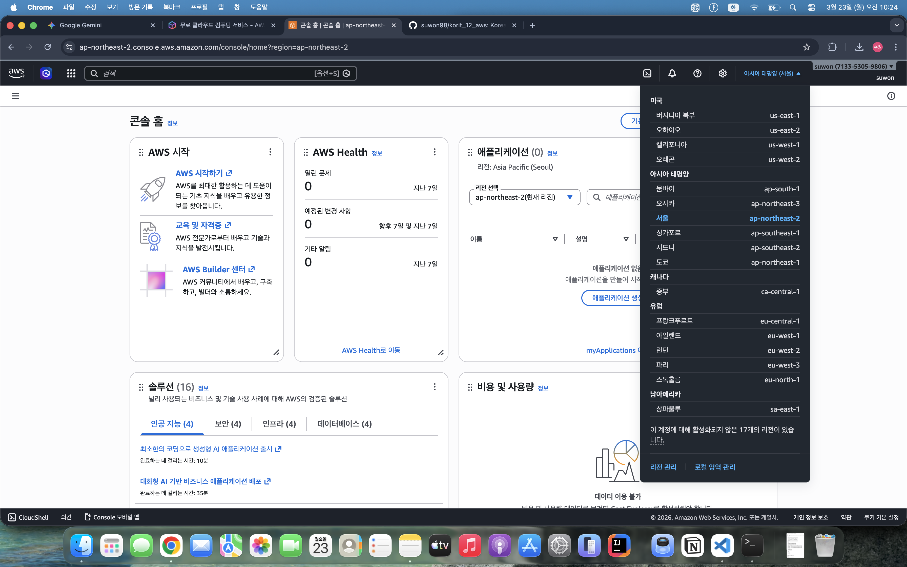
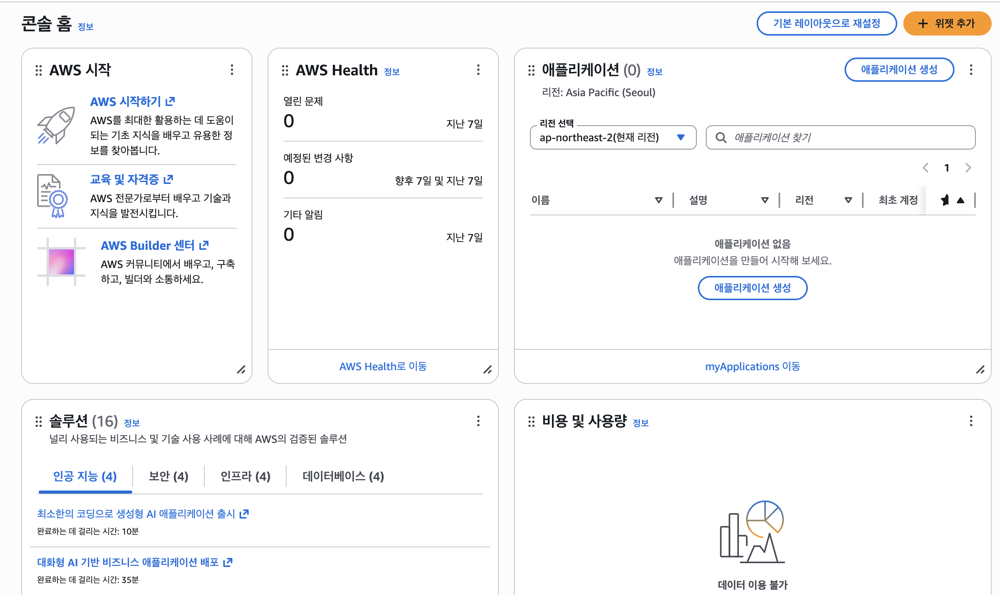
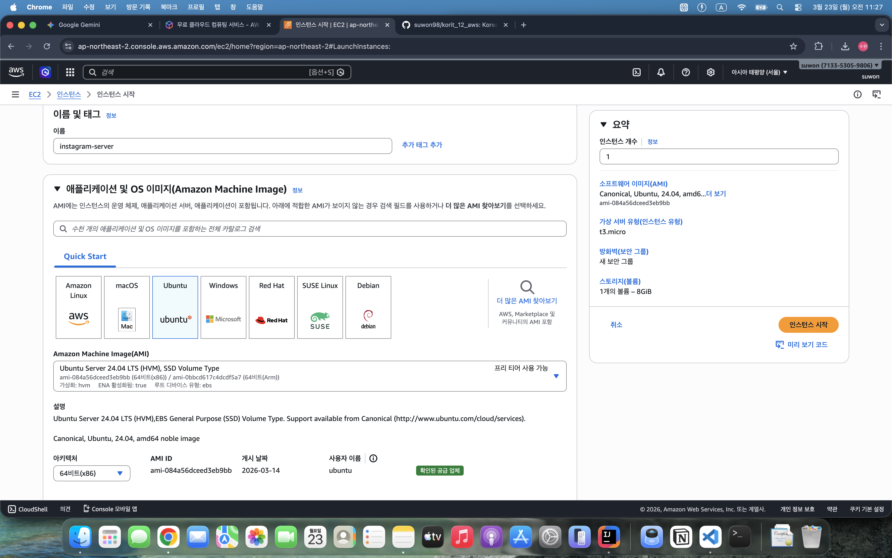
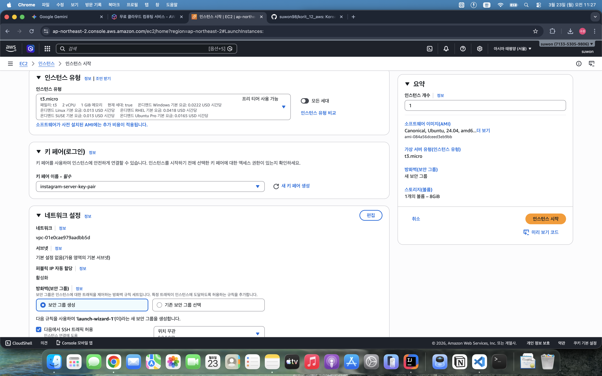
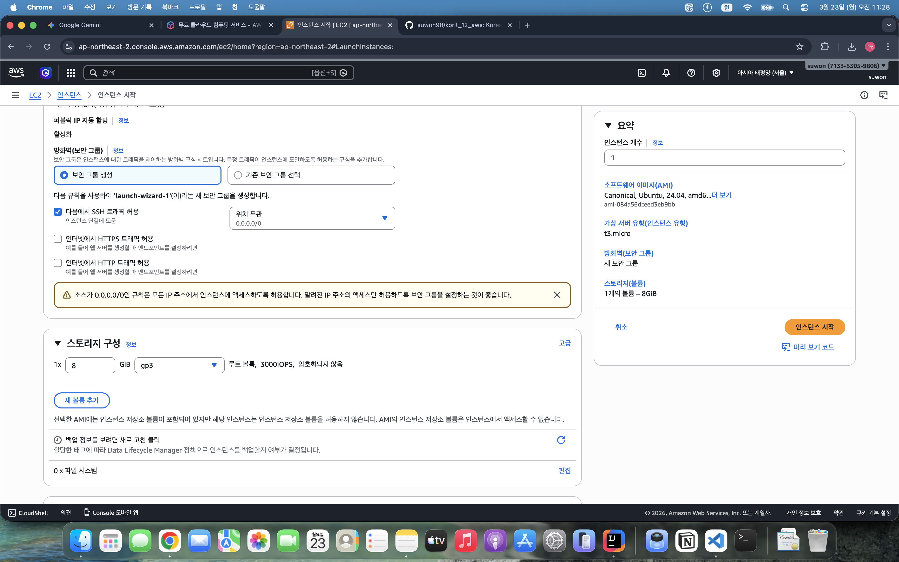
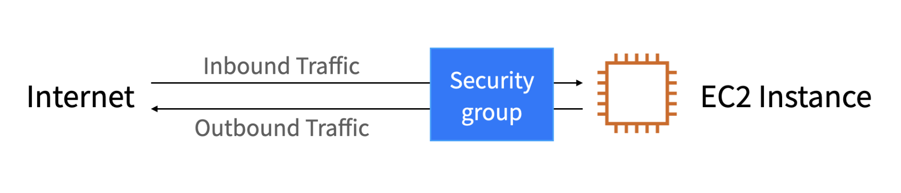
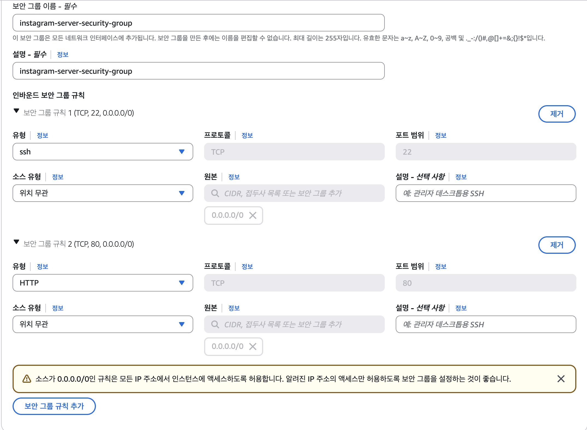

# AWS 시작하기
## AWS 란 ?
### 클라우드 컴퓨팅(Cloud Computing)
데스크탑 컴퓨터를 사용하려면 본체 전원이 켜져있어야 할겁니다.
웹 서비스를 운영하고 있다면 서비스를 실행하고 있는 컴퓨터의 본체를 관리해야 할 겁니다.
만약에 본체가 꺼지게 된다면 사용자가 웹 사이트에 접속하지 못하게 되겠네요.

이상의 문제를 해결하기 위한 개념이 클라우드 컴퓨팅입니다.
즉 서버나 스토리지, 데이터베이스 등 **컴퓨터 자원을 필요한 만큼만 원격으로 빌려서 사용할 수 있도록 하는 기술**을 의미합니다.
AWS, MS Azure, GCP 등을 예로 들 수 있는데, 가장 시장 점유율이 높은 AWS를 기준으로 수업합니다.

### AWS
처음에는 그냥 웹 사이트 호스팅하는 정도로 쓰였는데 오늘 날에는 DB, Storage, AI 등 다양한 서비스를 제공하고 있습니다.
즉 기업은 AWS에서 컴퓨터 자원을 빌려서 사용하고, 사용량에 따라 비용을 지불하는 형태로, 기업은 운영 비용을 줄이고, AWS 자체가 발전함에 따라 신기술을 빠르게 도입할 수 있다는 장점이 있습니다.

### 프로젝트 배포할건데 굳이 AWS 학습 따로 하는 이유
1. 시장 점유율 : 24년 기준 과학기술정보통신부 조사에 따르면 클라우드 서비스를 이용하는 국내 기업의 60%정도가 AWS 활용하는 것으로 나옵니다.
2. 다양한 서비스와 통합 옵션 : 컴퓨팅, 스토리지, DB, AI, 머신러닝 등 다양한 서비스를 제공하고, 쉽게 연동이 가능하다는 점에서 복잡한 프로젝트를 효율적으로 운영 가능합니다.(다만 서비스 종류가 너무 많아서 AWS 자체에 대한 학습이 요구된다는 점이 좀 단점입니다)
3. 글로벌 인프라 : 전세계적으로 사용 가능하다.

### AWS 리전(region)
region의 사전적인 의미는 지역이지만, AWS에서의 개념적 정의는 이하와 같습니다.
`AWS가 전 세계에서 데이터센터를 클러스팅하는 물리적 위치`. 근데 너무 어려우면 `AWS가 컴퓨터들을 실제로 설치해둔 위치` 라고 받아들이셔도 무방합니다.
이상에서 말한 것처럼 개발자나 기업들은 클라우드 컴퓨팅 서비스에서 사용자가 컴퓨터를 빌리게 되는데, 이렇게 AWS에서 빌려준 컴퓨터들을 실제로 만져볼 수는 ㄴ없지만 전세계에 물리적으로 어딘가에 설치가 되어있습니다.
그런데 사용자들이 모여있는 지역을 중심으로 여러 위치에 데이터센터를 설치하게 되는데, 이를 리전이라고 표현한다고 볼 수 있겠습니다.

1. 특징
  1. 전세계적으로 다양한 리전을 보유하고 있습니다. 그리고 어느 지역의 컴퓨터를 빌릴 것인지는 사용자가 직접 선택이 가능합니다.
  2. 리전 마다 고유 코드가 배정되어있습니다. 종종 리전의 코드값을 사용할 일이 있으므로 알아두는 것이 좋습니다(그리고 default로 만들면 버지니아 북부로 잡히기 때문에 자주 설정을 건드려줘야 합니다).
  
  이상은 리전의 예시입니다.
  3. 리전 선택의 기준 : 서비스를 주로 사용하는 사용자들과 가까운 위치로 선택하는게 베스트.
    - 사용자가 웹 사이트에 접속할 때에는 네트워크 통신을 이용합니다. frontend에서 backend, 그리고 DB로 연결되는 구조를 우리는 생성했습니다. 그런데 한국에서 브라우저로 접속했는데 backend가 미국 버지니아 북부에 있고, db가 오사카에 있으면, 부산에서 브라우저 접속했다가 버지니아 북부 찍고, http method 요청이 뭔지 확인한 다음에 오사카에 있는 db를 가서 CRUD를 수행하고 다시 버지니아 북부 찍고 부산으로 올겁니다. 인터넷이 연결된 선을 통해서 신호를 주고 받으면서 웹사이트와 상호작용이 이루어지는데, 물리적인 거리가 멀어질수록 신호를 주고 받는 시간이 오래 걸리게 됩니다(핑이라고 하기도 합니다).

### AWS 중 본시 수업에서 배우는 서비스
  1. EC2
  2. Route53(이건 유로라서 생략할 수도 있습니다. - 대체 수업 다른걸로 할 예정)
  3. Elastic Load Balancer (ELB)
  4. RDS
  5. S3
  6. CloudFront

## AWS Console


# EC2로 백엔드 서버 배포하기
## 필수 개념 및 EC2
### 배포(Deployment)
- 기능 구현이 끝나고, 테스트도 완료했으니까 배포하자는 표현이 나오는데, 여기서 말하는 배포란 **구현한 서비스를 서버나 클라우드 환경에 업로드** 하는 것을 의미합니다. 서비스를 배포하면 사용자가 인터넷을 통해 해당 서비스를 이용할 수 있습니다(이전까지는 localhost:8080에서만 가능합니다).


일반적으로 웹 서비스를 개발할 때 로컬호스트라는 '자신의 컴퓨터 주소'를 사용합니다.
근데 외부에서는 접속할 수가 없기 떄문에 클라우드 환경에 웹 서비스를 배포해야 합니다. 예를 들어 EC2에 웹 서비스를 배포하면 다른 컴퓨터에서도 접근할 수 있는 **퍼블릭 IP 주소** 를 획득하게 됩니다. 사용자는 인터넷에서 이 IP 주소를 사용해서 접속이 가능해집니다.

### IP 주소
인터넷에서 **특정 컴퓨터를 가리키는 주소**로, 모든 컴퓨터에 IP 주소가 부여되어있습니다.
IP 주소는 이하처럼 숫자와 점으로 이루어집니다.
`13.250.15.132` 와 같은 방식입니다.

### 포트(Port)
**한 컴퓨터 내에서 실행되는 특정 프로그램의 주소**
`13.250.15.132:8080`이라고 하면 특정 컴퓨터에서 8080 프로그램을 실행했다는 의미입니다. 즉, 웬만하면 springboot 프로젝트를 실행했다고 볼 수 있겠네요 :5173이라면 vite 프로젝트를 실행했다는 뜻이 되겠습니다. 그러면 : 앞부분에 우리는 보통 localhost라는 표현을 썼는데, 이는 매번 자기 컴퓨터 IP 주소 외워서 쓰기 귀찮으니까 환경변수로 자기 컴퓨터는 localhost라는 변수에 할당했기 때문입니다.

- 잘 알려진 port : 0 ~ 65535 번까지 있는데, 이 중 0 ~ 1023 번까지는 특정 용도로 사용하도록 권장되어있는데, 이렇게 역할이 정해진 포트를 well-knon port라고 합니다

  1. 22 : ssh 방식으로 통신할 때 사용합니다. 그럼 또 ssh는 뭐냐 할 수 있는데 EC2에 컴퓨터를 빌려놓고 여기에 접속할 때 22 번 포트를 사용합니다. Secure Shell의 축약어입니다.
  2. 80 : HTTP 방식으로 통신할 때 사용합니다. 포트 번호가 입력되지 않으면 기본적으로 80번 포트를 통해서 통신하도록 규약(protocol)으로 정해져있습니다.
  3. 443 : https:// 방식으로 통신을 할 때 사용합니다. http://www.naver.com 으로 접속하면 80번 포트로 요청을 보내고 https://www.naver.com으로 접속하면 네이버 서버의 443번 포트로 요청을 보냅니다.

- 참고 : 그러면 꼭 지켜야 하는가 ? - 권장사항이라서 꼭 그렇지는 않습니다. 일부러 다른거 써서 잠재적인 공격을 줄이기 위해 비틀어놓는 경우도 있습니다.

### EC2
- 정의 : 원격으로 접속해 사용할 수 있는 컴퓨터를 빌려주는 서비스.
### EC2 인스턴스
- 정의 : EC2라는 서비스에서 빌리는 컴퓨터 한 대를 의미합니다. 컴퓨터를 구매할 때 그래픽 특화로 할지, 용량이 큰 걸 할지 등 옵션을 선택할 수 있는데, EC2에서도 동일합니다.
  1. os 이미지 : ec2 내에 탑재된 운영체제를 의미합니다. windows나 mac도 있고, 가장 가볍게 쓰기 위해서는 리눅스 기반의 ubuntu를 씁니다.
  2. 인스턴스 유형 : 컴퓨터 사양을 의미합니다.
  3. 스토리지 : 인스턴스 역시 컴퓨터이기 때문에 파일을 저장할 용량이 필요합니다(저희 springboot 프로젝트를 올릴 용량은 있어야겠네요).

### EC2 사용 이유
1. 관리 부담 절감 : 정전 등 예상치 못한 상태가 벌어졌을 때 웹 서비스에 접근하지 못하게 됩니다. 그래서 막 서버실에 에어컨 켜놓고 있는거죠.
2. 쉬운 보안 설정 : 개인이 전부 다 보안설정 해두는게 어려울 수 있는데 아예 템플릿으로 AWS에서 제공하기 때문에 배우기에 복잡해보이지만 해두면 웬만한 수준의 보안은 할 수 있다는 장점이 있습니다.

- 실무에서는 ? : 여전히 많이 씁니다.


## EC2 세팅하기




### EC2 세팅하기 - 보안 그룹(Security Group)

보안 그룹이란 AWS 클라우드에서의 네트워크 보안을 의미합니다.
EC2 인스턴스를 집이라고 가정하고, 보안그룹은 집 바깥쪽에 있는 울타리 및 대문이라고 생각할 수 있겠습니다. 인스턴스 내부로 들어오기 전에 특정 요청이 접근해도 되는 요청인지 아닌지를 검사하는 형태라고 볼 수 있겠습니다.

이러한 규칙은 Inbound / Outbound로 나뉘어져있습니다.
1. inbound : 외부에서 EC2 인스턴스로 보내는 트래픽
2. outbound : EC2 인스턴스에서 외부로 나가는 트래픽
을 의미합니다. 여기서 어떤 트래픽만 허용할지 설정하는 것이 가능합니다.


- 보안 그룹 설정
외부에서 EC2로 접근할 포트는 _22 번 포트_ 와 _80 번 포트_ 라고 가정하고 이 두 가지에 대한 인바운드 보안 규칙을 설정할 예정입니다. 22 번 포트는 우리가 EC2에 원격 접속할 때 쓰는거니까, 외부에서 인터넷으로 EC2로 들어가니까 꼭 필요하겠네요. 그리고 80 번 포트는 백엔드 서버를 띄울 거니까 RESTful API의 특징상 HTTP 메서드들 과련 요청이 들어갈겁니다.




### EC2에 백엔드 서버 올리기

- 터미널 띄우는 것까지 했습니다.
- 지금 그러면 우분투 OS가 깔려있는 EC2에 연결을 했다고 보시면 됩니다.
- 그럼 이 컴퓨터에 저희는 SpringBoot 프로젝트를 설치해야하고, 이 프로젝트를 실행시켜야 할겁니다.
  intellij에서는 ctrl + f10 눌러서 실행시켰지만 지금 저희가 빌린 컴퓨터 내에서는 IDE가 존재하지 않기 때문에 명령어를 통해서 실행시켜야겠네요.
- 그리고 여기에는 Java도 안깔려있을겁니다. 저희는 여태까지 프로젝트 생성시에 Java 버전을 고정시켜두는 방법을 써왔지 OS 전체에 Java를 설치하는 명령어를 배우지 않았었습니다.
- Java 설치 명령어
```cmd
sudo apt update

sudo apt install openjdk-17-jdk -y
```
sudo - super user do

설치 되었는지 확인하는 명령어
```cmd
java -version
```
이제 제가 예시로 올려둔 프로젝트(압축파일과 같습니다)를 clone하겠습니다.

```cmd
git clone https://github.com/maybeags/ec2_springboot_sample.git
```
cloning이 끝났다면 루트 프로젝트 폴더로 들어갈 필요가 있습니다.
```
cd ec2_springboot_sample
```

현재 EC2 빌렸고, 보안그룹 설정, EC2로 연결해서 Java 설치했고, 프로젝트 설치한 후에 root 프로젝트 디렉토리로 들어가는 것까지 했습니다.

그런데 application.properties가 없는 상태입니다. 여기에 저희는 DB 비밀번호라든지 ddl 설정이라든지 다 들어가있었는데 없는 상태로 올렸습니다. 그 이유는 client-id와 같은 민감한 정보들이 다 들어가있기 때문에 Git으로 버전 관리를 하지 않는 것이 일반적이기 때문입니다. 그래서 이러한 파일들은 별도로 올리거나, 그것도 아니면 EC2 내에서 직접 만드는 것이 편하기도 합니다.

이번에는 .properties가 아니라 .yml로 만들겁니다. 그런데 특정 경로에 만들어야 하기 때문에 cd 명령어를 통해서 루트프로젝트/src/main/resources 까지 들어갔습니다.
```cmd
cd src/main/resources
```
그 다음에 application.yml을 만드는 명령어
```
vi application.yml
```
복사 붙여넣기 ctrl + shift + v

```yml
server:
  port: 80
```
주의 사항 : 스페이스바 두 번입니다. 다 입력하시고 나서 esc 누르고 `:wq`를 쓰면 원래대로 빠져나옵니다.
제대로 썼는지 확인하기 위한 명령어 : 
```
cat application.yml
```
이게 properties 기준으로 하면
```properties
server.port: 80
```

이제 백엔드 서버를 실행해봐야 합니다.
서버 실행용 스크립트 작성하겠습니다. 먼저 루트 프로젝트로 이동해야 합니다.
```
cd ../../../ -> ec2_springboot_sample 폴더까지 나와야 함.
```
`../ -> 상위로 올라갈 때 폴더 당 ../`
현재 경로는 그러면

`ubuntu@ip-172-31-14-112:~/ec2_springboot_sample$ `

이상의 경로에서 이제 CLI로 빌드 및 실행시키는 부분으로 넘어가야 합니다.

```
./gradlew clean build # 기존 빌드된 파일을 삭제하고 새롭게 JAR 파일로 빌드함
```

지금 저렇게 하니까 Permission denied 되어있어서 권한 풀어주겠습니다.
```
chmod +x gradlew
```

`./gradlew clean build` 명령어를 실행시키게 되면 build 폴더 내에 libs라고하는 폴더가 생깁니다.
루트 프로젝트 폴더 기준으로 
`cd build/libs` 로 들어간 뒤에 `ls`를 통해서 파일 목록을 확인하게 되면 `aws-ec2-springboot-0.0.1-SNAPSHOT-plain.jar  aws-ec2-springboot-0.0.1-SNAPSHOT.jar`이런 파일(jar) 두 개가 있음을 확인할 수 있습니다. 이 중 두 번째 파일을 통해서 backend를 실행시키려고 합니다.

`sudo java -jar aws-ec2-springboot-0.0.1-SNAPSHOT.jar`

vi application.yml 가서 i 누르면 insert 모드

## 탄력적 IP 연결하기

- 중지 전 나의 public ip : http://54.180.227.250/
- 재시작 후 나의 public ip : http://43.201.110.87/

EC2 인스턴스를 중지하고 다시 시작할 때마다 public ip의 주소가 변경됩니다. 이렇게 주소가 변경되면 기존 사용자가 서버 껐다가 켤 때마다 ip 주소가 바뀌기 떄문에 서비스에 접속하지 못할 수 있으므로 AWS에서는 탄력적 IP를 제공하여 변경되지 않도록 지원합니다.

### 탄력적 IP
- AWS 공식에서는 탄력적 IP 주소란 동적 클라우드 컴퓨팅을 위해 고안된 정적 IPv4 주소를 의미합니다.
- 바뀌지 않는 고정된 IP 주소.

- EC2 인스턴스를 생성하면 public ip 주소를 할당받는데, 이것은 임시 ip이므로 EC2 인스턴스를 유지 보수 등의 문제로 정지했다가 다시 재시작하게 되면 ip 주소가 바뀌게 됩니다. 그러면 frontend는 기존 backend와 통신을 할 수 없게 될 겁니다(.env 파일에 VITE_API_URL='http://localhost:8080';)으로 잡아놨던 부분에서 localhost 부분을 ip 주소로 갈아끼워야 하는데, EC2를 켜고 끌 때마다 .env를 수정해줘야 한다는 의미가 되겠습니다.

`sudo java -jar aws-ec2-springboot-0.0.1-SNAPSHOT.jar` 를 실행시키기 위해서는 build/lib까지 들어가야 합니다.
- 되는 것을 확인했었기 때문에 새로 ./gradlew clean build 를 할 필요는 없었음.
- 포트 넘버를 확인했을 때 80인 상태로
- http://각자퍼블릭ip:80


이번 시간에 한거
1. 탄력적 IP 개념
2. 탄력적 IP 발급 방법
3. 기존 인스턴스와 연결
4. backend EC2에서 실행

### 비용이 나가지 않게 EC2 삭제하는 방법
1. 인스턴스 종료
  - 그리고 딸려있는 애들도 같이 삭제 했습니다 -> key pair / security group이었습니다.
  - 그럼 그 말은 key pair 와 security group은 걔가 참조하고 있는 인스턴스가 있을 때 먼저 삭제할 수 없다는 겁니다. 즉 cascading이 불가능하다는거네요.
2. 탄력적 IP Release
  - 얘는 정확하게 얘기하면 탄력적 ip 와 인스턴스간의 연결을 끊는게 아니라 탄력적 ip 자체를 날린다는 의미입니다. 그런데 왜 삭제가 아니냐 하면 이 ip 주소값을 전세계의 누군가가 가져가지고 다시 재사용하게될 수도 있기 때문입니다.
3. 인스턴스 삭제
  - 위에서 삭제했는데 대시보드보니까 반영이 늦게 되어있었습니다. 하지만 `실행중`이 아니라면 돈 들지 않기 때문에 신경쓰지 않겠습니다.

  - 그리고 IP주소로 들어가는게 불편해서 영어 주소값 있으면 좋겠다 -> domain 개념으로 연결됩니다.
  - 백엔드 서버만 있고 DB는 로컬에서 돌려야 하나요? -> RDS 서비스 사용